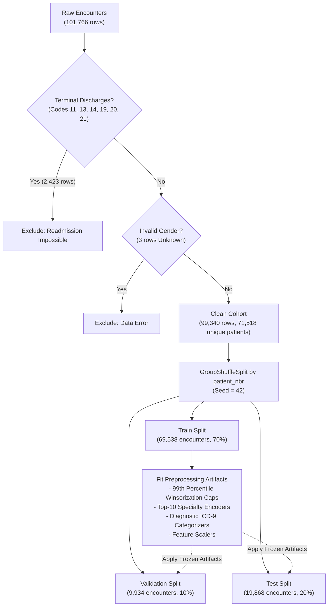
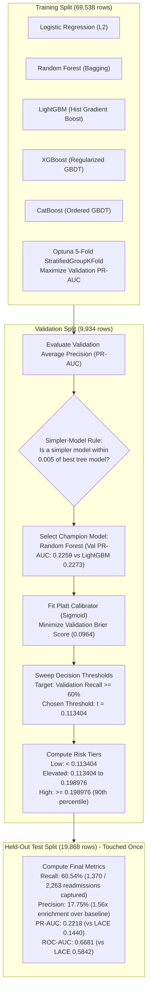
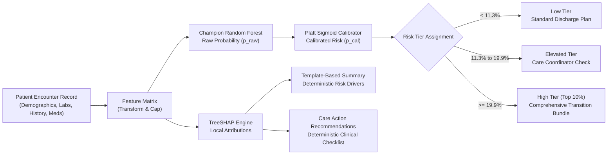

# Technical Guide: 30-Day Hospital Readmission Risk Prediction

## 1. Problem Statement and Clinical Objectives

### Clinical context
Diabetes mellitus is a chronic metabolic disorder that frequently leads to acute complications and hospitalizations. A major operational and clinical challenge in inpatient care is unplanned 30-day readmission: when a discharged patient is readmitted to a hospital within 30 days of release. Unplanned readmissions represent potential breakdowns in discharge coordination, incomplete stabilization, medication reconciliation issues, or unmonitored post-discharge complications.

In hospital administration, readmissions incur substantial penalties from healthcare regulators (such as the Centers for Medicare and Medicaid Services Hospital Readmissions Reduction Program). More importantly, early identification of vulnerable patients enables proactive interventions:
- Scheduling home-health nurse visits within 48 to 72 hours.
- Conducting pharmacist-led discharge medication reconciliation.
- Verifying access to outpatient primary care follow-up.
- Reinforcing disease education and glycemic self-monitoring.

### The engineering and machine learning challenge
From an engineering perspective, this problem is framed as a supervised binary classification task on tabular electronic health record (EHR) data:
- **Input ($X$)**: Tabular demographic, administrative, diagnostic, and medication features recorded during an index hospital encounter.
- **Target ($y$)**: Binary indicator where $y = 1$ if the patient is readmitted within 30 days of discharge, and $y = 0$ otherwise.

### Core constraints
1. **Classical machine learning only**: No generative artificial intelligence (GenAI) or large language models (LLMs) are permitted in prediction or explanation pathways. Generative models introduce hallucination risks, non-deterministic outputs, and significant computational overhead. All predictions must come from classical tabular models, and explanations must stem from exact mathematical attributions (TreeSHAP, logistic regression odds ratios) rendered through deterministic text templates.
2. **Strict prevention of data leakage**: In healthcare datasets, a single patient often experiences multiple hospital encounters over several years. Random row-level splitting causes identical patients to appear in both training and test sets, artificially inflating metrics through patient identity memorization rather than generalizable clinical patterns. All splitting must be clustered strictly by patient identifier (`patient_nbr`).
3. **Calibrated probability outputs**: Standard decision trees output crude proportions that do not reflect true statistical likelihoods. The system must output calibrated probabilities that directly reflect observed empirical frequencies.
4. **Recall-first clinical utility**: Readmissions are imbalanced (only ~11.4% of encounters end in 30-day readmission). A standard classification threshold of 0.5 results in near-zero recall. The operational threshold must prioritize high sensitivity (recall $\ge 60\%$) while balancing hospital staff capacity.

---

## 2. High-Level Solution and Engineering Architecture

The architecture separates data preprocessing, feature engineering, model training, post-processing calibration, explainability, fairness audits, and interactive presentation into discrete, reproducible pipeline stages.

```
+------------------------------------------------------------------------------------------------+
|                                       OFFLINE PIPELINE                                         |
|                                                                                                |
|   +-------------------+       +-----------------------+       +----------------------------+   |
|   | 101,766 Raw Rows  | ----> | Exclusions & Cleaning | ----> | GroupShuffleSplit (Patient)|   |
|   | (UCI 130-US Hosps)|       | 99,340 Clean Encounters|       | 70% Train, 10% Val, 20% Tst|   |
|   +-------------------+       +-----------------------+       +----------------------------+   |
|                                                                             |                  |
|                                                                             v                  |
|   +-------------------+       +-----------------------+       +----------------------------+   |
|   | Post-Processing   | <---- | 5 ML Models Registered| <---- | Feature Transformations    |   |
|   | Platt Calibration |       | Hyperparameter Tuning |       | Training-Fitted Only       |   |
|   | Thresholding      |       | Simpler-Model Champion|       | Outliers, Encoders, Scales |   |
|   +-------------------+       +-----------------------+       +----------------------------+   |
|             |                                                                                  |
|             v                                                                                  |
|   +-------------------+       +-----------------------+       +----------------------------+   |
|   | Explainability    | ----> | Fairness Audits       | ----> | Exported File Artifacts    |   |
|   | TreeSHAP Contribs |       | Subgroup Disparities  |       | Parquet, JSON, Joblib      |   |
|   | Odds Ratios       |       | Threshold Mitigation  |       | Zero Runtime Retraining    |   |
|   +-------------------+       +-----------------------+       +----------------------------+   |
+------------------------------------------------------------------------------------------------+
                                              |
                                              v
+------------------------------------------------------------------------------------------------+
|                                    ONLINE APPLICATION TIER                                     |
|                                                                                                |
|       +--------------------------------------------------------------------------------+       |
|       | Streamlit Presentation Layer (8 Interactive Pages, Flat Clinical Design)       |       |
|       | - Overview: Headline numbers, project scope, and data health cards             |       |
|       | - Data Quality: Missingness breakdown and exclusion documentation              |       |
|       | - Exploration: Feature distributions and HbA1c testing impact analysis         |       |
|       | - Models: 5-model comparison, clustered bootstrap intervals, and LACE baseline |       |
|       | - Threshold: Operational threshold selection, capacity simulation, DCA curve  |       |
|       | - Explainability: Global TreeSHAP importances, odds ratios, modifiable signal  |       |
|       | - Fairness: Subgroup disparity audits, equalized odds gaps, and mitigation     |       |
|       | - Patient Risk: Real-time scoring, local waterfall, and care action checklist  |       |
|       +--------------------------------------------------------------------------------+       |
+------------------------------------------------------------------------------------------------+
```

---

## 3. Workflow Diagrams

### Data processing and leakage prevention workflow



### Model selection, calibration, and threshold optimization workflow



### Individual patient scoring and clinical decision workflow



---

## 4. Repository and Folder Structure

```
d:\hackfest\hospital_readmission\
├── .env.example                     # Template for environment configurations
├── .gitignore                       # Standard version control exclusions
├── .progress.md                     # Session progress ledger tracking prompts and test results
├── .python-version                  # Pinned Python version (3.11)
├── Makefile                         # Unified development task runner (test, lint, pipeline)
├── README.md                        # Primary project documentation
├── pyproject.toml                   # Build metadata and package dependencies
├── pytest.ini                       # Pytest configuration and warning filters
├── requirements.txt                 # Exact pinned dependency specifications
│
├── configs/                         # Declarative system configurations
│   ├── config.yaml                  # Pipeline hyperparameter bounds, paths, and seeds
│   └── care_actions.yaml            # Clinical intervention checklist mapping
│
├── data/                            # Raw data documentation
│   ├── README.md                    # Data origin and UCI benchmark notes
│   └── raw/                         # Raw CSV input files (git-ignored)
│
├── src/readmission/                 # Core machine learning package
│   ├── __init__.py                  # Package root
│   ├── data.py                      # Data ingestion, terminal exclusions, validation
│   ├── split.py                     # GroupShuffleSplit by patient_nbr and winsorization caps
│   ├── feature_definitions.py       # Constants, dictionaries, ICD-9 mappings, rationale
│   ├── features.py                  # Discharge-time feature transformation logic
│   ├── models.py                    # Estimator constructors and hyperparameter search grids
│   ├── model_registry.py            # Model registry mapping and complexity ranking
│   ├── calibrate.py                 # Sigmoid and isotonic probability calibrators
│   ├── evaluate.py                  # Held-out test split evaluation and metrics generation
│   ├── scoring.py                   # Raw probability scoring and encounter frame assembly
│   ├── stages.py                    # Orchestrator functions for stages 1 through 9
│   ├── fair_stages.py               # Orchestrator functions for fairness and sensitivity checks
│   ├── pipeline.py                  # Unified CLI runner (--mode full, --mode fast)
│   ├── explain.py                   # Fast exact TreeSHAP computation and label mappings
│   ├── textgen.py                   # Deterministic clinical explanation template generator
│   ├── oddsratio.py                 # Logistic regression odds ratios with clustered errors
│   ├── fair_stats.py                # Subgroup audit metrics, disparity gaps, Wilson CIs
│   ├── bootstrap.py                 # Clustered bootstrap confidence intervals
│   ├── baselines.py                 # Approximate LACE clinical index baseline
│   ├── decision_curve.py            # Decision curve analysis (clinical net benefit)
│   ├── hba1c.py                     # Observational HbA1c testing statistical analysis
│   ├── blend.py                     # 5-model logistic meta-model blend comparison
│   └── sensitivity.py               # First-encounters-only sensitivity validation
│
├── app/                             # Streamlit web application frontend
│   ├── main.py                      # Application entry point and page routing
│   ├── style.py                     # Flat CSS design tokens, typography, and card helpers
│   ├── loaders.py                   # Caching artifact loaders with safe error boundaries
│   ├── charts.py                    # Reusable Plotly chart builders
│   └── pages/                       # Multi-page user interface views
│       ├── overview.py              # Page 1: Headline metrics and project scope
│       ├── data_quality.py          # Page 2: Exclusions and missingness analysis
│       ├── exploration.py           # Page 3: Feature distributions and HbA1c testing
│       ├── models.py                # Page 4: Model comparison, bootstrap, LACE baseline
│       ├── threshold.py             # Page 5: Threshold selection, capacity, decision curves
│       ├── explainability.py        # Page 6: TreeSHAP, odds ratios, modifiable signal
│       ├── fairness.py              # Page 7: Demographic audits and mitigation comparison
│       └── patient_risk.py          # Page 8: Patient risk calculator and scenario planner
│
├── artifacts/                       # Pre-computed immutable model artifacts (read-only in app)
│   ├── clean.parquet                # Filtered cohort (99,340 rows)
│   ├── split.json                   # Train, validation, test encounter ID splits
│   ├── caps.json                    # 99th percentile numerical feature bounds
│   ├── feature_config.json          # Frozen categorical encoders and specialty levels
│   ├── best_params.json             # Optuna-tuned hyperparameters per model
│   ├── calibrators.joblib           # Serialized Platt sigmoid calibrators
│   ├── champion.json                # Champion selection metadata
│   ├── threshold.json               # Operating threshold and cost-optimal parameters
│   ├── tiers.json                   # Risk tier boundary definitions
│   ├── metrics.json                 # Comprehensive test split evaluation metrics
│   ├── model_comparison.csv         # Tabular benchmark across all 5 models
│   ├── test_predictions.parquet    # Test encounter predictions with calibrated probabilities
│   ├── shap_values.parquet          # Computed TreeSHAP values for test samples
│   ├── shap_importance.csv          # Global mean absolute SHAP feature ranking
│   ├── odds_ratios.csv              # Population odds ratios and confidence intervals
│   ├── fairness_audit.csv           # Subgroup metrics across age, gender, race
│   ├── fairness_mitigation.csv      # Disparity comparison across mitigation variants
│   ├── bootstrap_vs_baseline.csv    # Clustered bootstrap paired difference distributions
│   ├── lace.json                    # LACE clinical baseline performance numbers
│   ├── decision_curve.parquet       # Net benefit calculations across decision thresholds
│   ├── hba1c.json                   # Crude and adjusted HbA1c testing outcome statistics
│   ├── blend.json                   # Logistic blend comparison metrics
│   └── sensitivity.json             # First-encounters-only validation metrics
│
├── docs/                            # In-depth architectural documentation
│   ├── reviewer_guide.md            # Plain-English guide for hackathon reviewers
│   ├── model_card.md                # Standardized model card (intended use, limitations)
│   ├── data_quality.md              # Missingness and exclusion audits
│   ├── decisions.md                 # Architectural decision records (ADRs)
│   ├── references.md                # Literature citations
│   └── screenshots/                 # Captured browser walkthrough screenshots
│
└── tests/                           # Pytest automated test suite
    ├── synth.py                     # Synthetic data generator for rapid testing
    ├── test_split.py                # Verification of zero patient leakage in splitting
    ├── test_features.py             # Feature transformation tests
    ├── test_calibrate.py            # Calibration monotonicity and Brier score tests
    ├── test_explain.py              # TreeSHAP mathematical sum and feature attribution tests
    ├── test_textgen.py              # Natural language template generation tests
    ├── test_fair_stats.py           # Fairness metrics and Wilson interval tests
    ├── test_baselines.py            # LACE index computation verification
    ├── test_scoring_parity.py       # Online scoring parity with offline artifacts
    ├── test_pipeline_determinism.py # Repeatable pipeline output verification
    └── test_app_pages.py            # Streamlit page loader and rendering sanity tests
```

---

## 5. Machine Learning Techniques and Algorithms Explained

### Why tabular classical ML instead of Deep Learning?
In modern computer vision or natural language processing, deep neural networks dominate because raw pixel grids and text tokens have rich spatial or sequential compositional structure. Tabular clinical data, however, consists of heterogeneous, non-continuous columns: discrete diagnoses (ICD-9 codes), bounded integer counts (prior hospital visits), binary indicators (medication changes), and categorical demographic groups.

Empirical machine learning research consistently shows that tree ensembles (Random Forests, Gradient Boosted Decision Trees) outperform deep neural networks on tabular data for several reasons:
- **Decision boundaries**: Tree algorithms partition feature spaces using axis-aligned orthogonal cuts, which fit tabular step-functions and threshold effects (such as blood glucose thresholds) far more naturally than smooth hyperplanes created by neural network weight matrices.
- **Invariance to uninformative scaling**: Decision trees only depend on the rank ordering of continuous values, making them invariant to monotonic scaling and extreme outliers.
- **Sample efficiency**: Tree algorithms converge rapidly on tens of thousands of rows without requiring massive pretraining corpora.
- **Exact explainability**: Tree structures allow direct calculation of exact polynomial-time Shapley values via TreeSHAP without Monte Carlo approximations.

### The 5 registered models

#### 1. Logistic Regression (Linear baseline)
- **How it works**: Logistic regression computes a weighted linear combination of input features $z = \beta_0 + \sum \beta_i x_i$ and maps this score through the logistic sigmoid function $\sigma(z) = \frac{1}{1 + e^{-z}}$ to yield a probability between 0 and 1.
- **Role in project**: Serves as our primary linear benchmark and provides interpretable Odds Ratios ($\text{OR} = e^{\beta_i}$) representing population-level relative risk per unit change in a predictor.

#### 2. Random Forest (Bagged decision trees)
- **How it works**: An ensemble of hundreds of independent decision trees trained on bootstrap samples of the training data (bagging: bootstrap aggregating). At each node split, only a random subset of features is evaluated. Predictions are made by averaging the probability outputs across all individual trees.
- **Role in project**: Captures complex non-linear feature interactions and high-order combinations without gradient descent step tuning. Selected as our Champion Model due to its strong PR-AUC (0.2218 on test) and parsimonious architectural complexity.

#### 3. LightGBM (Histogram-based gradient boosted decision trees)
- **How it works**: LightGBM builds trees sequentially (boosting). Each new tree is trained to predict the residual error (gradient) of the preceding trees. It uses histogram binning (discretizing continuous values into 256 integer bins) and grows trees leaf-wise rather than level-wise, splitting the leaf node that produces the largest loss reduction.
- **Role in project**: Delivers fast training and achieves the highest raw validation PR-AUC (0.2273).

#### 4. XGBoost (Extreme Gradient Boosting)
- **How it works**: An implementation of gradient boosted trees that incorporates second-order Taylor expansion approximations of the loss function, explicit L1 ($\alpha$) and L2 ($\lambda$) regularization on leaf weights, and column subsampling to prevent overfitting.
- **Role in project**: Provides a regularized gradient boosting comparison point.

#### 5. CatBoost (Categorical Boosting)
- **How it works**: CatBoost specializes in categorical features by performing ordered target encoding on the fly, preventing target leakage during tree construction. It builds symmetric (oblivious) decision trees where every node at the same depth uses the exact same split criterion, enabling SIMD vectorization at inference time.
- **Role in project**: Robust handling of high-cardinality categorical variables.

### Hyperparameter optimization: Optuna with Stratified Group K-Fold
Hyperparameters (tree depth, learning rate, subsample ratios, minimum child weights) were optimized using Optuna, a Bayesian optimization framework using Tree-structured Parzen Estimators (TPE).
- **Grouped Cross-Validation**: To preserve patient isolation, 5-fold cross-validation was partitioned using `StratifiedGroupKFold` grouped on `patient_nbr`. This ensures all visits by any patient are strictly isolated to either the train or validation fold during cross-validation.
- **Optimization Metric**: Hyperparameters were tuned to maximize Area Under the Precision-Recall Curve (PR-AUC / Average Precision), rather than ROC-AUC or accuracy, reflecting the severe class imbalance.

### Parsimonious champion selection: The simpler-model rule
In production engineering, simpler models are preferred over complex models if performance is comparable because simpler architectures are easier to debug, faster to score, and less prone to distribution shifts.
- **Pre-committed rule**: We sort registered models by architectural complexity:
  $$\text{Logistic Regression} \prec \text{Random Forest} \prec \text{LightGBM} \prec \text{XGBoost} \prec \text{CatBoost}$$
- If a simpler model achieves validation average precision within 0.005 of the highest-scoring model, the simpler model is selected as Champion.
- **Outcome**: LightGBM achieved a validation PR-AUC of 0.2273. Random Forest achieved 0.2259 (difference of 0.0014, well below the 0.005 tolerance). Random Forest was selected as the Champion Model.

---

## 6. Post-Processing and Decision Science

### Probability calibration: Platt scaling vs Isotonic regression
Raw probability outputs from machine learning models are often poorly calibrated:
- Random Forests push predictions toward the center (e.g. 0.3 to 0.7) because averaging hundreds of trees smooths out extreme probabilities.
- Boosted trees can push probabilities toward 0 or 1 because gradient descent greedily minimizes cross-entropy loss.

In clinical screening, a doctor needs to know that if the model predicts a 15% probability of readmission, approximately 15 out of 100 such patients will actually be readmitted.
- **Platt Scaling (Sigmoid)**: Fits a univariate logistic regression model on out-of-fold validation scores:
  $$p_{\text{cal}} = \frac{1}{1 + e^{A \cdot s + B}}$$
- **Isotonic Regression**: Fits a non-parametric piecewise constant isotonic (monotonically non-decreasing) step function.
- **Selection**: We compare 5-fold grouped cross-validated Brier scores (mean squared error between predicted probabilities and binary outcomes). Platt scaling achieved lower Brier scores across our models (Random Forest: 0.096419) and was selected.

### The threshold problem in imbalanced clinical screening
Standard machine learning libraries default to a decision threshold of $t = 0.5$. In this dataset, the 30-day readmission prevalence is only 11.39%. Applying a 0.5 threshold produces a model that classifies almost all patients as negative, achieving high overall accuracy (~88.6%) but capturing zero readmissions (0% recall), making it clinically useless.

We implemented a recall-first thresholding policy:
1. **Primary Operating Threshold**: We swept validation probability cutoffs to achieve a pre-committed clinical sensitivity target of $\ge 60\%$ recall on validation data.
   - Selected threshold: $t = 0.113404$.
   - Held-out test performance at this threshold: **Recall = 60.54%**, **Precision = 17.75%**.
2. **Cost-Optimal Threshold**: We evaluated a cost curve parameterized by hospital economics where missing a readmission carries an assumed 5x penalty relative to the cost of an unnecessary post-discharge check ($C_{\text{FN}} = 5.0, C_{\text{FP}} = 1.0$). The cost-minimizing threshold was identified at $t = 0.177143$.

### Decision curve analysis (Clinical net benefit)
Standard ROC and PR curves measure statistical discrimination but ignore clinical trade-offs. Decision Curve Analysis (DCA) calculates the Net Benefit of using a predictive model across a continuum of patient or clinician threshold probabilities ($p_t$):

$$\text{Net Benefit} = \frac{\text{True Positives}}{N} - \frac{\text{False Positives}}{N} \cdot \left(\frac{p_t}{1 - p_t}\right)$$

DCA plots this net benefit against two standard clinical strategies:
- **Treat All**: Assign intensive post-discharge follow-up to every discharged patient.
- **Treat None**: Provide standard care to all patients without special follow-up.
Across clinical thresholds from 8% to 25%, the Champion Random Forest model provides strictly superior net benefit compared to treating all patients, treating no patients, or using the heuristic LACE clinical score.

### Clinical risk tiering
Rather than providing clinicians with an abstract floating-point number, predictions are mapped into three actionable clinical tiers:
- **Low Risk** ($p_{\text{cal}} < 0.1134$): Below the screening cutoff. Standard discharge workflow.
- **Elevated Risk** ($0.1134 \le p_{\text{cal}} < 0.1990$): Flagged for phone follow-up within 72 hours and primary care verification.
- **High Risk** ($p_{\text{cal}} \ge 0.1990$, the 90th percentile of cohort risk): Intensive transition bundle: pharmacist medication reconciliation, home nurse visit, and endocrinologist telehealth consultation.

---

## 7. Model Interpretability and Explainability

### TreeSHAP (Local and global feature attribution)
Shapley values originate from cooperative game theory, representing the unique payout allocation among cooperating players that satisfies four fundamental axioms: efficiency, symmetry, dummy player, and additivity.

TreeSHAP computes exact Shapley values directly from the decision tree split structures in $O(T L D^2)$ time (where $T$ is the number of trees, $L$ is maximum leaves, and $D$ is maximum tree depth), avoiding exponential combinatorial evaluations.
- **Local Explanation**: For any single patient encounter, the calibrated probability is decomposed into a base rate plus individual feature pushes:
  $$f(x) = \phi_0 + \sum_{i=1}^M \phi_i(x)$$
- **Global Importance**: The overall importance of feature $i$ across the entire hospital cohort is calculated as the mean absolute SHAP value:
  $$I_i = \frac{1}{N} \sum_{j=1}^N |\phi_{i}(x_j)|$$
  The top historical driver of readmission risk across the population is `number_inpatient` (mean absolute SHAP = 0.0476), followed by `discharge_group` (0.0394) and `prior_visits_total` (0.0332).

### Logistic regression odds ratios with cluster-robust standard errors
While TreeSHAP explains tree models, logistic regression provides population-level relative effect estimates. Because patients have repeated encounters, standard regression errors underestimate uncertainty. We estimated parameters using generalized estimating equations (GEE) with clustered sandwich standard errors grouped by `patient_nbr`:
- **Discharge to home** is strongly protective relative to discharge to a care facility ($\text{OR} = 0.564$, 95% CI $[0.527, 0.603]$, $p < 10^{-60}$).
- **Elective admission** is associated with lower odds of readmission compared to urgent or emergency intake.

### Deterministic natural language explanations (Zero LLM)
To provide safe, auditable explanations for healthcare providers without language model hallucinations:
- TreeSHAP contributions for an encounter are ranked by absolute magnitude.
- The top contributing features are mapped to clinical labels.
- Pre-defined deterministic string templates populate exact clinical numbers (for example: *"Patient has 2 prior inpatient admissions in the past 12 months, which adds +5.2% to predicted readmission risk"*).

### Modifiable versus fixed signal share
In clinical reality, many strong predictors (such as age or prior hospitalizations) are fixed historical facts that cannot be altered by medical staff.
- **Fixed Features** (82.1% of TreeSHAP signal): Prior inpatient visits, age, number of chronic diagnoses, baseline lab procedure counts.
- **Modifiable Features** (17.9% of TreeSHAP signal): Discharge destination arrangements, diabetes medication adjustments, insulin therapy modification, and HbA1c testing follow-up.
Highlighting modifiable features directs care coordinators toward levers they can actively influence at the time of discharge.

---

## 8. Algorithmic Fairness and Disparity Mitigation

### Audited demographic dimensions
Machine learning models deployed in hospitals risk amplifying systemic disparities. We audited the Champion Model across three sensitive demographic attributes:
1. **Age Band**: `<40`, `40-59`, `60-79`, `80+`
2. **Gender**: `Female`, `Male`
3. **Race**: `Caucasian`, `AfricanAmerican`, `Other`, `Missing`

### Fairness criteria and empirical disparities
We evaluated the following fairness criteria:
- **Demographic Parity**: Selection rates (percentage of patients flagged as high risk) should be equal across groups.
- **Equalized Odds**: True Positive Rates (Recall) and False Positive Rates (FPR) should be equal across groups.
- **Empirical Findings in Base Model**:
  - Across race and gender, disparities were small (race Equalized Odds difference = 0.0341; gender = 0.0516).
  - Across age bands, a noticeable disparity emerged (Equalized Odds difference = 0.2551). Elderly patients ($80+$) experience a False Positive Rate of 50.7%, whereas patients under 40 have an FPR of 25.2%. This disparity is clinically driven: elderly diabetic patients have higher multi-morbidity and baseline frailty, causing the model to assign higher risk scores.

### Mitigation strategies evaluated
1. **Group-Specific Thresholds (Post-Processing / Equal Opportunity)**:
   - Adjusts the decision cutoff threshold per age subgroup on validation data to align true positive rates.
   - Result: Reduces age FPR difference from 0.2551 to 0.2409 while raising overall test recall to 62.40%.
2. **Sample Reweighing (In-Processing)**:
   - Computes balancing weights for each (group, label) pair during training inversely proportional to their empirical joint frequency:
     $$W(g, y) = \frac{P(g) \cdot P(y)}{P(g, y)}$$
   - Result: Substantially closes the age disparity: Equalized Odds difference drops from 0.2551 to 0.2200, and True Positive Rate difference drops from 0.2041 to 0.1574, while maintaining strong clinical utility (63.94% recall and 16.90% precision).

---

## 9. Machine Learning Glossary and Jargon Buster

| Term / Jargon | Formal Engineering Definition | Plain-Language Clinical Analogy |
|---|---|---|
| **Encounter** | A single hospital stay from admission timestamp to discharge timestamp. | A single visit to the hospital. One patient can have multiple visits over time. |
| **Index Encounter** | The reference hospital admission from which the 30-day post-discharge window is tracked. | The starting hospital stay whose discharge we are monitoring. |
| **Readmission** | An unplanned subsequent hospital admission occurring within 30 days of release. | Returning to the hospital bed within one month of going home. |
| **Ground Truth ($y$)** | The verified binary outcome observed in historical records ($1 = \text{readmitted}, 0 = \text{safe}$). | What actually happened to the patient in reality. |
| **Class Imbalance** | Disproportionate ratio of negative examples to positive examples in the dataset (88.6% vs 11.4%). | Finding a needle in a haystack: most patients do not get readmitted. |
| **Data Leakage** | Contamination of training data with information from validation/test sets or the future. | Giving a student the exam answer key before the test, making them look deceptively capable. |
| **Patient-Level Split** | Partitioning records by patient identity rather than row numbers to prevent leakage. | Keeping all visits by Patient X in the study group and none in the final test exam. |
| **Recall (Sensitivity / TPR)** | $\frac{\text{TP}}{\text{TP} + \text{FN}}$: Fraction of actual readmissions successfully flagged by the tool. | Out of 100 returning patients, how many did the screening tool catch? |
| **Precision (PPV)** | $\frac{\text{TP}}{\text{TP} + \text{FP}}$: Fraction of flagged patients who truly readmit within 30 days. | Out of 100 alarms sounded by the tool, how many were real emergencies? |
| **Specificity (TNR)** | $\frac{\text{TN}}{\text{TN} + \text{FP}}$: Fraction of non-readmitted patients correctly left unflagged. | Out of 100 healthy patients, how many were correctly left alone? |
| **False Positive Rate (FPR)** | $\frac{\text{FP}}{\text{FP} + \text{TN}} = 1 - \text{Specificity}$: Fraction of safe patients falsely flagged. | False alarms per 100 safe discharges. |
| **ROC Curve** | Plot of True Positive Rate versus False Positive Rate across all possible thresholds. | A curve showing trade-offs between alarm sensitivity and false alarm rates. |
| **ROC-AUC** | Area Under ROC Curve: Probability that a random positive is ranked higher than a random negative. | How well the tool ranks sick patients ahead of healthy patients overall. |
| **PR Curve** | Plot of Precision versus Recall across all possible thresholds. Preferred in imbalanced data. | A curve showing how pure our alarm list stays as we try to catch more sick patients. |
| **PR-AUC (Average Precision)** | Area Under Precision-Recall Curve: Summarizes positive detection power across all recall levels. | Overall performance score for finding positive cases without being fooled by negatives. |
| **Calibration** | Degree to which predicted probabilities match empirical observed event frequencies. | If the tool says "15% risk", does reality show exactly 15 out of 100 people returning? |
| **Brier Score** | Mean squared difference between predicted probability and true binary outcome ($0$ or $1$). | A penalty score for bad probability guesses; lower score means sharper, truer probabilities. |
| **Platt Scaling** | Fitting a univariate logistic regression curve over raw model scores to calibrate probabilities. | Adjusting a bathroom scale that consistently reads 5 pounds too high. |
| **Decision Threshold ($t$)** | Numerical cutoff above which a patient is classified positive ($p_{\text{cal}} \ge t \implies \text{flag}$). | The alarm volume trigger level: lower trigger catches more cases but makes more noise. |
| **Decision Curve (DCA)** | Economic evaluation plotting clinical Net Benefit against threshold probability. | A cost-benefit graph showing if using the model is better than giving extra care to everyone. |
| **Net Benefit** | Penalized rate of true detections minus false alarms weighted by clinician threshold odds. | The net clinical profit of screening after paying the cost of false alarms. |
| **TreeSHAP** | Algorithm calculating Shapley values for tree ensembles based on game-theoretic marginal payouts. | A fair point-scoring system dividing credit for a prediction among a patient's health traits. |
| **Odds Ratio (OR)** | Multiplicative change in the odds of an outcome per unit increase in an exposure ($e^\beta$). | How many times higher your risk odds become if a specific health condition is present. |
| **Demographic Parity** | Fairness condition requiring equal positive selection rates across demographic groups. | Sounding alarms on the same percentage of elderly and young patients regardless of health. |
| **Equalized Odds** | Fairness condition requiring equal True Positive and False Positive Rates across groups. | Ensuring the tool is equally accurate and produces equal false alarms across all demographic groups. |
| **Winsorization** | Capping extreme numerical outliers at a pre-determined percentile (e.g. 99th percentile). | Setting a speed limit so one patient with 50 visits doesn't break the statistical scale. |
| **LACE Index** | Standard bedside clinical score based on Length of stay, Acuity, Charlson score, and ER visits. | The traditional pen-and-paper checklist doctors currently use to estimate readmission risk. |

---

## 10. Application Walkthrough and Visual Workflows

The web application is built with Streamlit and features a flat clinical user interface. The entire interface was verified in browser automated sessions.

```
==================================================================================================
BROWSER WALKTHROUGH DEMO RECORDING:
file:///d:/hackfest/hospital_readmission/docs/screenshots/ui_workflow_demo_1791630923618.webp
==================================================================================================
```

### Page 1: Overview
The Overview page serves as the clinical dashboard landing view, presenting headline project scope metrics, dataset dimensions, and pipeline architecture status.


- **Headline Cards**: Displays clean total counts: 101,766 raw records, 99,340 clean encounters across 71,518 unique patients, and an 11.2% crude readmission prevalence.
- **Champion Highlight**: Shows the selected Champion Model (Random Forest) with its held-out test split PR-AUC (0.222) and ROC-AUC (0.668).
- **Architecture Overview**: Summarizes the 5-step leak-free pipeline structure and scope boundaries.

---

### Page 2: Data Quality & Exclusions
This page provides transparency into every record dropped, missingness handling rationale, and feature selection evidence.


- **Terminal Discharge Exclusions**: Explains why 2,423 encounters were removed (discharge disposition codes 11, 13, 14, 19, 20, 21 indicating expired or hospice status, where readmission is biologically impossible).
- **Missingness Audit Table**: Documents high missingness attributes (`weight`: 96.86% missing; `payer_code`: 39.56% missing) and shows how `race` is preserved via an explicit `Missing` category.
- **Leakage Prevention**: Confirms that winsorization caps and categorical groupings were fit exclusively on training data.

---

### Page 3: Clinical Exploration & HbA1c Analysis
The Exploration page enables interactive investigation into univariate and bivariate clinical drivers of readmission, concluding with a formal observational analysis of glycated hemoglobin (HbA1c) testing.


- **Prior Inpatient Utilization**: Visualizes how readmission risk rises steeply with prior hospital visits.
- **HbA1c Testing Analysis**: Investigates testing rates across 99,340 encounters. Testing was ordered in only 17.4% of admissions. When HbA1c testing is accompanied by diabetes medication adjustments, crude readmission rates show a modest reduction compared to high levels without therapy changes.
- **Cluster-Adjusted Logistic Regression**: Displays odds ratios accounting for within-patient correlation.

---

### Page 4: Model Performance & Benchmark Comparison
The Models page presents the evaluation of all five registered machine learning models against clinical and meta-ensemble baselines on the held-out test set.


- **Unified Benchmark Table**: Compares Logistic Regression, Random Forest, LightGBM, XGBoost, and CatBoost on held-out test data across Recall, Precision, PR-AUC, ROC-AUC, Specificity, and Brier Score.
- **LACE Clinical Baseline**: Proves that our Random Forest champion (+0.084 AUC lift) substantially outperforms the standard LACE clinical score (PR-AUC 0.1440, ROC-AUC 0.5842).
- **Clustered Bootstrap Intervals**: Presents 1,000 patient-clustered bootstrap resamples with 95% confidence intervals and paired difference tests, demonstrating that Random Forest beats logistic regression in 99.1% of resamples.
- **First-Encounters Sensitivity Check**: Demonstrates that model discrimination remains stable (ROC-AUC = 0.6527) when evaluated exclusively on patients' first hospital visits.

---

### Page 5: Operating Threshold & Follow-Up Capacity
This page addresses the operational decision problem: selecting an actionable classification threshold that balances clinical sensitivity against care coordinator bandwidth.


- **Operating Threshold Selection**: Explains why $t = 0.113404$ was selected on validation data to meet an operational recall goal of $\ge 60\%$.
- **Cost-Optimal Curve**: Visualizes misclassification cost curves under an assumed 5:1 penalty ratio ($C_{\text{FN}} = 5, C_{\text{FP}} = 1$).
- **Decision Curve Analysis (Net Benefit)**: Proves that the Champion Model delivers superior net clinical benefit compared to "treat all" and "treat none" policies across clinical thresholds from 8% to 25%.
- **Capacity Simulator**: Allows clinical managers to adjust monthly follow-up staffing limits and view projected capture rates and workload metrics.

---

### Page 6: Model Explainability (TreeSHAP & Odds Ratios)
The Explainability page bridges statistical modeling and clinical comprehension through exact mathematical attribution and population relative risks.


- **Global TreeSHAP Ranking**: Highlights `number_inpatient`, `discharge_group`, and `prior_visits_total` as the strongest global predictors.
- **Odds Ratios Table**: Shows GEE logistic odds ratios with 95% confidence intervals, highlighting that home discharge is strongly protective ($\text{OR} = 0.564$).
- **Modifiable vs. Fixed Signal Share**: Features a horizontal bar chart showing that 17.9% of model signal comes from actionable factors (medications, discharge location) while 82.1% stems from fixed medical history.

---

### Page 7: Algorithmic Fairness & Mitigation Audit
This page documents our demographic fairness audit and evaluates the efficacy of two disparity mitigation techniques.


- **Subgroup Metric Visualizations**: Audits True Positive Rate, False Positive Rate, and Selection Rate across Age Bands, Gender, and Race with 95% Wilson score confidence intervals.
- **Equalized Odds Gaps**: Identifies that age exhibits the largest baseline disparity (Equalized Odds difference = 0.2551), driven by higher baseline frailty in patients $80+$.
- **Mitigation Comparison**: Evaluates Group Thresholds versus Sample Reweighing. Reweighing during training successfully shrinks the age Equalized Odds gap to 0.2200 while maintaining a strong 63.94% recall on test data.

---

### Page 8: Patient Risk Calculator & Scenario Recourse Planner
The Patient Risk page is the bedside operational view used by discharge care coordinators.


- **Interactive Encounter Selector**: Loads any held-out patient encounter from the test split.
- **Calibrated Probability and Risk Tier**: Displays calibrated risk percentage, cohort percentile (e.g. 93rd percentile), and assigned clinical tier (High Risk).
- **Local TreeSHAP Waterfall Plot**: Decomposes the individual score into positive risk drivers (e.g. prior inpatient stays, high lab counts) and protective factors (e.g. home discharge).
- **Deterministic Natural Language Summary**: Renders an explanation built from string templates without language model hallucination.
- **What-If Scenario Recourse Planner**: Allows coordinators to simulate interventions (e.g. modifying discharge disposition from facility to home health services) and observe real-time risk reduction.
- **Actionable Care Checklist**: Dynamically activates tailored clinical recommendations based on the patient's specific modifiable risk profile.

---

## 11. How to Run, Test, and Verify

### Environment setup
The project requires Python 3.11 with virtual environment isolation:

```bash
# Clone the repository and enter directory
cd d:\hackfest\hospital_readmission

# Create and activate virtual environment
python -m venv .venv
source .venv/bin/activate       # Linux/macOS
& .venv\Scripts\Activate.ps1    # Windows PowerShell

# Install pinned dependencies
pip install -r requirements.txt
```

### Running the pipeline
To re-run all pipeline stages from raw data to saved artifacts:

```bash
# Fast execution mode (subsampled training, runs in ~5-6 minutes)
python -m readmission.pipeline --mode fast

# Full execution mode (complete Optuna search grids and full training)
python -m readmission.pipeline --mode full

# Re-run specific pipeline stages
python -m readmission.pipeline --fast --from-stage score
python -m readmission.pipeline --only evaluate
```

### Running the test suite and linter
All tests and style checks can be executed via pytest and ruff:

```bash
# Run unit and integration tests (excluding slow determinism test)
pytest -q -m "not slow"

# Verify scoring parity between online calculator and offline artifacts
pytest tests/test_scoring_parity.py -q

# Run fast code linter across source, app, and test code
ruff check src app tests
```

### Starting the interactive web application
To launch the Streamlit frontend:

```bash
# Start Streamlit local server
streamlit run app/main.py --server.port 8501

# The application is accessible at: http://localhost:8501
```
