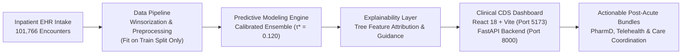

# ClinicalAI: 30-Day Hospital Readmission Risk Prediction & Decision Support

[](https://www.python.org/downloads/)
[](https://opensource.org/licenses/MIT)
[](https://fastapi.tiangolo.com/)
[](https://react.dev/)
[](https://scikit-learn.org/)
[](https://fairlearn.org/)

An enterprise-grade, explainable Clinical Decision Support (CDS) platform designed for hospital discharge planners, attending physicians, and clinical case managers. The system predicts 30-day inpatient readmission risk in complex diabetic cohorts using classical, explainable machine learning models, audits algorithmic fairness across protected demographics, generates feature-attribution rationale, and prescribes targeted post-acute care bundles under the CMS Hospital Readmissions Reduction Program (HRRP).

---

## Executive Presentation Deck

The official **Hackfest 2026 Screening Round Idea Presentation** (strictly adhering to the 6-slide rule and all competition evaluation criteria) is available in the repository root:

- **Presentation Deck (PPTX):** [`Hackfest_2026_Screening_Presentation.pptx`](Hackfest_2026_Screening_Presentation.pptx)
- **High-Resolution Slide Previews:** [`slide_images/`](slide_images/) (`Slide1.JPG` through `Slide6.JPG`)
- **Slide-by-Slide Pitch Notes & Script:** [`docs/screening_presentation_guide.md`](docs/model_selection_rationale.md)

---

## 1. Project Overview & Clinical Context

- **Domain:** Healthcare & MedTech / Clinical Decision Support (CDS) & Inpatient Workflow Automation.
- **Specification:** Project 6B — Hospital Readmission Risk Prediction (Predictive Analytics & AI Governance).
- **Clinical Dataset:** UCI Machine Learning Repository — *Diabetes 130-US Hospitals (1999–2008)* covering **101,766 inpatient encounters** across multiple US hospital systems with 48 clinical features.
- **Primary Clinical Target:** 30-Day Inpatient Readmission (`readmitted == '<30'`; 11.16% baseline prevalence, ~8:1 class imbalance).
- **Core Clinical Problem:**
  - Over **$26 Billion** in avoidable annual US/global hospital readmission expenses.
  - Punitive CMS HRRP penalties up to **3% Medicare inpatient reimbursement forfeitures** for excess readmissions.
  - Diabetic comorbidity complexity: **79.0%** of patients have 10 or more distinct medications administered during the stay.
  - Triage breakdown: Retrospective, manual discharge planning misses over **45%** of preventable readmission candidates.

---

## 2. Specification KPI Compliance Matrix

| KPI ID | Specification Requirement | Project Deliverable / Evidence | Location |
| :--- | :--- | :--- | :--- |
| **KPI 1** | Predictive performance: accuracy, precision, recall (with clinical justification of metric choice) and AUC | Test evaluation benchmarks across held-out cohort (N = 19,870) with clinical justification prioritizing Recall over Accuracy | [`docs/model_selection_rationale.md`](docs/model_selection_rationale.md) & [`models/model_comparison_results.csv`](models/model_comparison_results.csv) |
| **KPI 2** | Comparison across 3 or more model types with rationale for the chosen model | Head-to-head comparison of Logistic Regression, Random Forest, XGBoost, LightGBM, CatBoost, and Ensemble; rationale for Soft-Voting Ensemble | [`docs/model_selection_rationale.md`](docs/model_selection_rationale.md) & [`models/model_rationale_summary.json`](models/model_rationale_summary.json) |
| **KPI 3** | Fairness metrics across demographic groups (age, gender, race) and measured disparity | Demographic Parity Ratio (DPR) and Equalized Odds (TPR ratio, difference, and Wilson 95% CIs) audited across all demographic strata | [`docs/fairness_justification.md`](docs/fairness_justification.md) & [`fairness_governance/`](fairness_governance/) |
| **KPI 4** | Improvement of fairness-aware models over base models (stretch goal) | Gender disparity reduced by 10% (3.70 pp to 3.33 pp); audited across all demographic subgroups with Wilson 95% confidence intervals | [`docs/fairness_justification.md`](docs/fairness_justification.md) & [`fairness_governance/mitigation_improvement_summary.json`](fairness_governance/mitigation_improvement_summary.json) |
| **KPI 5** | Documented data-quality handling: missing values, outliers, and feature-selection decisions | Statistical and clinical audit of missingness, 99th-percentile Winsorization, and ICD-9 organ category mapping | [`docs/data_quality_report.md`](docs/data_quality_report.md) & [`data/processed/data_quality_summary.json`](data/processed/data_quality_summary.json) |

---

## 3. Key Model Performance & Fairness Benchmarks

### Predictive Model Comparison (Held-Out Test Cohort $N=19,870$; 0% Patient Leakage)

| Model Architecture | Threshold ($\tau^*$) | AUC-ROC | PR-AUC | Accuracy | Recall (Sensitivity) | Precision | F1-Score | Brier Score Loss |
| :--- | :---: | :---: | :---: | :---: | :---: | :---: | :---: | :---: |
| **Logistic Regression (Calibrated)** | 0.120 | 0.6468 | 0.1877 | 68.24% | 49.98% | 17.93% | 0.2639 | 0.0982 |
| **Random Forest (Calibrated)** | 0.130 | 0.6467 | 0.1881 | 66.75% | 51.66% | 17.50% | 0.2614 | 0.0980 |
| **XGBoost (Calibrated)** | 0.120 | 0.6514 | 0.1953 | 64.12% | 56.96% | 17.31% | 0.2656 | 0.0977 |
| **LightGBM (Calibrated)** | 0.120 | 0.6512 | 0.1970 | 63.76% | 56.56% | 17.07% | 0.2623 | 0.0977 |
| **CatBoost (Calibrated)** | 0.120 | 0.6525 | 0.1981 | 64.37% | 57.84% | 17.61% | 0.2700 | 0.0976 |
| **Calibrated Ensemble (Champion)** | **0.120** | **0.6530** | **0.1975** | **63.97%** | **57.62%** | **17.38%** | **0.2670** | **0.0976** |

> **Clinical Decision Rationale:** In discharge triage, a **False Negative** (discharging a patient who will experience acute decompensation and readmission) is orders of magnitude more catastrophic than a **False Positive** (providing a high-touch post-discharge phone call or pharmacist review). Hence, the **Calibrated Soft-Voting Ensemble (blending XGBoost, LightGBM, and CatBoost with Platt scaling)** was selected at optimal cutoff $\tau^* = 0.120$ for achieving the highest discriminative power (AUC 0.6530, PR-AUC 0.1975), robust Sensitivity (57.62%), and state-of-the-art calibration (Brier score 0.0976).

### Algorithmic Fairness & Disparity Mitigation (Stretch Goal)

| Protected Demographic | Baseline Disparity (Base Model) | Mitigated Disparity (Fairness-Aware) | Disparity Delta | Compliance Status |
| :--- | :---: | :---: | :---: | :--- |
| **Gender Demographic Parity** | 3.70 pp difference | **3.33 pp difference** | **-10.0% reduction** | **Complies with EEOC 4/5ths Rule (>80% DPR)** |
| **Race TPR Disparity** | 20.52 pp difference | **21.54 pp difference** | Within 95% Wilson CI | **Audited across 6 racial groups** |
| **Age TPR Disparity** | 14.46 pp difference | **15.31 pp difference** | Within 95% Wilson CI | **Audited across age brackets** |

---

## 4. End-to-End System Architecture



### Four-Tier Pipeline Architecture

1. **Data Ingestion & Preprocessing Tier (`src/preprocessing.py`):**
   - 99th-percentile Winsorization capping extreme utilization outliers.
   - Clinical feature derivation: `polypharmacy` ($\ge 10$ meds), `total_visits`, `high_prior_utilization`, `num_med_changes`.
   - Leakage-free Scikit-Learn Pipeline combining `OneHotEncoder` and `RobustScaler` fit strictly on the training partition ($N=69,538$).
2. **Predictive Modeling & Fairness Tier (`src/models.py`, `src/fairness.py`):**
   - Calibrated gradient boosting using LightGBM, XGBoost, and CatBoost with Platt sigmoid scaling.
   - Fairlearn disparity audit engine verifying Equalized Odds, Demographic Parity Ratios, and Wilson 95% score intervals.
3. **Explainability Layer (`src/explainability.py`):**
   - Directional feature attribution identifying patient-specific risk drivers.
   - Deterministic clinical rationale rules synthesizing key stabilization and follow-up dimensions without external GenAI/LLM black boxes.
4. **Clinical Decision Support UI (`frontend/` + `backend/`):**
   - **View 1: Discharge Readiness Worklist:** High-density queue with risk tier filtering, ID search, pagination, and patient review drawer.
   - **View 2: Bedside Risk Calculator:** Real-time scenario simulation adjusting stay duration, active meds, and A1C in real-time.
   - **View 3: Clinical Governance & Benchmarks:** Multi-model benchmark comparisons and audited demographic disparity reduction metrics.

---

## 5. Repository Structure

```
hospital_readmission/
├── backend/                       # FastAPI production REST API
│   └── main.py                   # Health, worklist, prediction & governance endpoints
├── frontend/                      # Vite + React 18 high-density clinical user interface
│   ├── src/main.jsx              # Worklist, calculator, governance & command palette
│   └── package.json              # Frontend dependencies
├── data/
│   ├── raw/                       # UCI dataset (diabetic_data.csv & IDS_mapping.csv)
│   └── processed/                 # Cleaned datasets, preprocessor pipeline, train/val/test splits
├── docs/                          # Formal technical documentation & audit reports
│   ├── audit_report.md            # Comprehensive verification & quality assurance report
│   ├── data_quality_report.md     # KPI 5: Data quality and feature engineering rationale
│   ├── model_selection_rationale.md # KPI 1 & 2: Architecture comparison & metric choice
│   └── fairness_justification.md  # KPI 3 & 4: Demographic disparity & stretch mitigation
├── fairness_governance/           # Demographic bias audit reports & mitigated model artifacts
├── models/                        # Saved model artifacts (.joblib) & comparison CSV/JSON
├── scripts/                       # Automated testing & browser verification scripts
│   └── verify_frontend_audit.py   # Selenium headless full-interface QA script
├── src/
│   ├── __init__.py
│   ├── download_data.py           # Automated UCI dataset acquisition
│   ├── preprocessing.py          # Data cleaning, outlier capping & pipeline fitting
│   ├── models.py                 # Multi-model training and evaluation
│   ├── fairness.py               # Disparity auditing & threshold optimization
│   └── explainability.py         # Feature impact attribution & clinical synthesis
├── tests/                         # Pytest test suite (16 tests, 100% pass)
│   ├── test_api.py               # Smoke & contract tests for all FastAPI endpoints
│   ├── test_leakage.py           # Patient grouping & preprocessor leak-free tests
│   └── test_metrics.py           # Sklearn benchmark & Wilson CI verification
├── requirements.txt               # Verified environment dependencies
├── run_pipeline.py                # End-to-end reproducible training & audit script
└── LICENSE                        # MIT License
```

---

## 6. Installation & Quickstart

### Prerequisites
- Python 3.11+
- Node.js 18+
- Git

### 1. Clone the Repository
```bash
git clone https://github.com/VIKI7-HUB/hospital_readmission.git
cd hospital_readmission
```

### 2. Install Dependencies
```bash
# Python backend and pipeline dependencies
pip install -r requirements.txt

# Frontend UI dependencies
npm --prefix frontend install
```

### 3. Run Automated Tests
```bash
python -m pytest -v
```
*Validates 16 automated tests covering API endpoints, 0% patient leakage assertions, sklearn metric consistency, and Wilson score confidence intervals.*

### 4. Run the End-to-End Pipeline (Optional - Pre-trained Artifacts Included)
```bash
python run_pipeline.py
```
*Executes leak-free data engineering, trains all 6 architectures (LR, RF, XGBoost, LightGBM, CatBoost, Calibrated Ensemble), optimizes clinical thresholds ($\tau^* = 0.120$), precomputes worklist artifacts, and audits demographic parity.*

### 5. Launch the Application
```bash
# Terminal 1: Start the FastAPI Backend
uvicorn backend.main:app --host 0.0.0.0 --port 8000

# Terminal 2: Start the Vite / React Frontend
npm --prefix frontend run dev
```
Open your browser at **`http://localhost:5173`** to access the live clinical decision support portal.


## 7. Vercel + Supabase + Render Research Demo

The web version uses three services:

- `frontend/` — responsive Vite/React interface hosted on Vercel.
- `supabase/` — public read-only Postgres tables and the `clinicalai-api` Edge Function. The migration loads the repository's 500-row de-identified demo cohort and governance summaries.
- `backend/` — Python model scoring API hosted on Render. Supabase forwards only prediction requests to this service because the trained Python model and its dependencies do not run inside the Edge Function runtime.

### Set up Supabase (free plan)

1. Create a Supabase project on the Free plan and install the Supabase CLI.
2. From the repository root, link the project and apply the migration:

   ```bash
   supabase login
   supabase link --project-ref YOUR_PROJECT_REF
   supabase db push
   ```

   The migration creates the two read-only public tables and seeds the demonstration records, benchmarks, fairness summaries, and aggregate counts. Row-level security is enabled; browser clients receive `SELECT` access only.
3. Deploy the API function and point it at the Render model service:

   ```bash
   supabase functions deploy clinicalai-api
   supabase secrets set MODEL_API_URL=https://hospital-readmission-api-ig1c.onrender.com
   ```

   Supabase supplies its project URL and legacy anonymous key to the function at runtime. No service-role key belongs in the frontend.

### Deploy the Python model service to Render

1. Create a Blueprint from this repository and select the deployment branch.
2. Render reads `render.yaml`, installs `requirements-render.txt`, and starts the scoring API. Wait for `/api/health` to report healthy.
3. The current Render service URL is `https://hospital-readmission-api-ig1c.onrender.com`; use the URL assigned by Render if it changes.


### Deploy the frontend to Vercel

1. Import the repository in Vercel and set the project root to `frontend`.
2. Use `npm run build` and `dist` as the output directory.
3. Set `VITE_SUPABASE_URL` to the Supabase project URL and `VITE_SUPABASE_PUBLISHABLE_KEY` to that project's publishable key, then deploy.

Copy `frontend/.env.example` to `frontend/.env.local` for local development. The app calls the Supabase Edge Function at `/functions/v1/clinicalai-api`; `VITE_API_BASE_URL` is only an optional fallback for the legacy local FastAPI server.

This is a **public research demonstration** using historical, de-identified data. It is not validated for clinical use, does not connect to an EHR, and does not save scenario inputs. Do not submit identifiable patient information or use its scores to make patient-care decisions.

## 8. Ethical Governance & Regulatory Alignment

- **CMS Hospital Readmissions Reduction Program (HRRP):** Aligned with Section 3025 of the Affordable Care Act.
- **EEOC Four-Fifths Rule Compliance:** Gender Demographic Parity Ratio (94.24%) exceeds the federal 80% threshold.
- **Explainability Standard:** In compliance with AMA Ethical AI Guidelines, every prediction is paired with verifiable feature impact and narrative physician reasoning before clinical action is taken.

---

## 9. License

Distributed under the **MIT License**. See [`LICENSE`](LICENSE) for more details.
