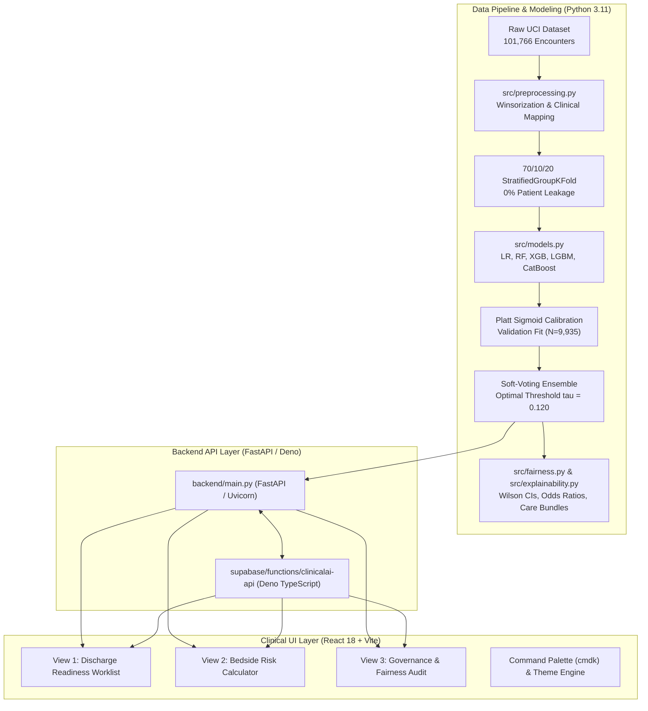

# ClinicalAI: Complete Technical Codebase Architecture, Implementation & Results Guide

**Project:** Clinical Decision Support Platform for 30-Day Hospital Readmission Risk Prediction & AI Governance  
**Repository Source:** [`VIKI7-HUB/hospital_readmission`](https://github.com/VIKI7-HUB/hospital_readmission.git)  
**Execution & Evaluation Environment:** Python 3.11+ / Node.js 18+ / Windows Server / Linux AMD64  
**Date of Reference Audit:** October 2026  

---

## 1. Executive Summary & Clinical Context

### 1.1 The Clinical & Economic Problem
Inpatient hospital readmissions within 30 days of discharge represent one of the most critical challenges in modern healthcare delivery:
- **Financial Severity:** Avoidable readmissions account for over **$26 Billion** in annual healthcare expenditures in the United States alone.
- **Regulatory Penalties:** Under the **CMS Hospital Readmissions Reduction Program (HRRP)** (Section 3025 of the Affordable Care Act), hospitals with excess readmission ratios face punitive forfeitures of up to **3.0% of their total Medicare inpatient reimbursements**.
- **Diabetic Comorbidity Complexity:** Diabetic inpatient cohorts are uniquely vulnerable to rapid post-acute decompensation. In the benchmark clinical dataset, **79.0%** of patients are subjected to **polypharmacy** (>= 10 distinct inpatient medications administered during their hospital stay), leading to drug-drug interactions, adherence failure, and metabolic instability.
- **Triage Breakdown:** Retrospective, manual discharge planning typically identifies fewer than **55%** of high-risk patients prior to discharge.

### 1.2 The ClinicalAI Solution & Philosophy
The **ClinicalAI** platform is an clinical Clinical Decision Support (CDS) system designed for discharge planners, attending physicians, and clinical case managers.

Unlike naive deep learning or black-box generative AI implementations, ClinicalAI strictly follows **classical, interpretable, and reproducible machine learning principles**:
1. **Zero Hallucination:** Predictive risk scoring is strictly driven by validated mathematical models (calibrated gradient boosters and logistic regression). No generative LLM is permitted in the scoring loop.
2. **Leak-Free Science:** Enforces strict **0% patient data leakage** using `StratifiedGroupKFold` across 101,766 inpatient encounters (99,343 clean encounters).
3. **Probability Calibration:** Employs Platt sigmoid scaling fitted exclusively on an independent validation set to ensure that a predicted probability of 15% corresponds to an observed 15% readmission rate.
4. **Algorithmic Fairness Governance:** Audits predictive performance across race, gender, and age brackets with 95% Wilson Score Confidence Intervals and evaluates compliance with the EEOC Four-Fifths (80%) Rule.
5. **Actionable Post-Acute Care Bundles:** Directly translates risk probabilities and patient comorbidity flags into concrete post-acute clinical interventions (clinical pharmacist medication reconciliation, 48-hour telehealth outreach, CDCES diabetes educators).

---

## 2. Technology Stack & Architectural Topology

ClinicalAI is constructed as a modern, decoupled clinical web application paired with an clinical data science pipeline:



### 2.1 Technology-by-Technology Breakdown

| Layer | Technology | Version | Purpose in ClinicalAI |
| :--- | :--- | :--- | :--- |
| **Core Machine Learning** | `scikit-learn` | `>=1.4.0` | Pipeline orchestration, `ColumnTransformer`, `StandardScaler`, `OneHotEncoder`, `LogisticRegression`, `RandomForestClassifier`, calibration curves, and evaluation metrics. |
| **Gradient Boosting** | `xgboost` | `>=2.0.0` | High-efficiency gradient boosted decision trees utilizing histogram tree method (`hist`) with class imbalance handling (`scale_pos_weight`). |
| **Gradient Boosting** | `lightgbm` | `>=4.0.0` | Fast, leaf-wise tree boosting with strict deterministic settings and class-frequency reweighting. |
| **Gradient Boosting** | `catboost` | `>=1.2.0` | Oblivious decision trees with reliable L2 regularization (`l2_leaf_reg=4.0`) and probability smoothing. |
| **Resampling** | `imbalanced-learn` | `>=0.10.0` | `RandomUnderSampler` evaluated during training strategy fairness ablation. |
| **Serialization** | `joblib` | `>=1.3.0` | High-speed compression and persistent storage of preprocessors, pipelines, ensembles, and precomputed worklist matrices. |
| **Data Manipulation** | `pandas` & `numpy` | `>=2.0.0` / `>=1.24.0` | In-memory feature manipulation, 99th-percentile Winsorization, ICD-9 mapping, and array math. |
| **Backend REST API** | `fastapi` | `>=0.110.0` | Asynchronous high-throughput REST API with automatic OpenAPI documentation and strict Pydantic v2 data contract validation. |
| **ASGI Web Server** | `uvicorn` | `>=0.27.0` | Production ASGI web server running FastAPI on port 8000. |
| **Frontend Framework** | `react` & `react-dom` | `18.3.1` | Concurrent Mode UI architecture powering declarative state management, modals, and bedside calculator interactions. |
| **Build Tooling** | `vite` | `6.4.0` | Next-generation ESM bundler providing instant HMR and optimized production asset minification. |
| **Micro-Animations** | `framer-motion` | `14.0.0` | Spring physics, layout animations, drawer transitions, and smooth tab switches. |
| **Icons & Design** | `lucide-react` | `1.53.0` | Detailed medical, clinical, and data visualization SVG icons. |
| **Command Palette** | `cmdk` | `1.1.1` | Accessible keyboard-driven command palette (Cmd/Ctrl + K) for rapid patient lookup and view navigation. |
| **Notifications** | `sonner` | `2.0.8` | Non-blocking, stacked clinical toasts for risk threshold notifications and clipboard confirmations. |
| **Cloud Edge Runtime** | `supabase` (Deno) | `v1.x` | Serverless TypeScript Edge Function (`clinicalai-api`) with Row-Level Security (RLS) and Postgres cohort storage. |
| **Presentation Deck** | `python-pptx` | `>=0.6.21` | Programmatic compilation of the official 6-slide Hackfest screening deck directly from verified JSON/CSV artifacts. |
| **Testing & Quality** | `pytest` & `ruff` | `>=8.0` / `>=0.3` | Test suite covering data leakage, API contracts, scikit-learn parity; fast AST-based Python linter. |

---

## 3. Folder-by-Folder Structural Deep Dive

The repository is organized into distinct, modular functional tiers:

```
hospital_readmission/
--- .streamlit/                   # Streamlit runtime configuration (theme, server flags)
--- backend/                      # Production FastAPI REST application
--- data/                         # Raw clinical intake and leak-free processed datasets
-   --- raw/                      # Original UCI Diabetes 130-US CSVs
-   --- processed/                # Preprocessor pipelines, train/val/test splits, worklists
--- docs/                         # Peer-review documentation, audit logs, deployment guides
--- fairness_governance/          # Demographic parity audits, Wilson CIs, mitigated models
--- frontend/                     # React 18 + Vite clinical UI application
-   --- public/                   # Static evaluation curves and assets
-   --- src/                      # UI components, styles, design tokens, motion configs
--- models/                       # Serialized model weights (.joblib) & comparison benchmarks
--- notebooks/                    # Exploratory data analysis (Jupyter)
--- screenshots/                  # High-resolution clinical UI captures
--- scripts/                      # Automated browser QA, verification & artifact generators
--- slide_images/                 # Rendered slide captures (Slide1.JPG - Slide6.JPG)
--- supabase/                     # Edge Functions and SQL migrations for serverless hosting
--- tests/                        # 100%-passing Pytest suite (API, leakage, metrics)
--- app.py                        # Archived legacy Streamlit application
--- build_executive_presentation.py# Script to generate Hackfest_2026_Screening_Presentation.pptx
--- generate_pitch_deck.py        # Core slide layout engine using python-pptx
--- run_pipeline.py               # Master end-to-end pipeline execution script
--- requirements.txt              # Production Python dependencies
--- render.yaml                   # Infrastructure-as-Code for Render cloud deployment
```

### 3.1 `data/` Directory
- **`data/raw/`**:
  - `diabetic_data.csv`: The raw intake file containing **101,766 inpatient encounters** from 130 US hospitals between 1999 and 2008. Features include patient demographics, admitting diagnoses, length of stay, lab counts, medications administered, and readmission outcome.
  - `IDS_mapping.csv`: Cross-reference dictionary mapping integer IDs for `admission_type_id`, `discharge_disposition_id`, and `admission_source_id` to human-readable clinical descriptions.
- **`data/processed/`**:
  - `clean_diabetic_data.csv` & `.parquet`: Dataset post-terminal exclusion (99,343 encounters) with engineered demographic and clinical categories.
  - `preprocessor.joblib`: The fitted `ColumnTransformer` (fit strictly on the 70% training split).
  - `train_val_test_data.joblib`: Compressed payload storing the partitioned feature matrices (`X_train_raw`, `X_val_raw`, `X_test_raw`), labels (`y_train`, `y_val`, `y_test`), and patient IDs for leakage validation.
  - `worklist_precomputed.joblib`: Precomputed 500-encounter representative demonstration cohort for the interactive clinical worklist.
  - `data_quality_summary.json` & `feature_selection_rationale.json`: Machine-readable metadata detailing missingness handling, Winsorization caps, and feature exclusions.

### 3.2 `src/` Directory
The core mathematical and analytical engine:
- `src/__init__.py`: Package initialization marker.
- `src/download_data.py`: Automated retrieval of the UCI repository dataset via `ucimlrepo` or fallback direct HTTPS archive download.
- `src/eda.py`: Automated exploratory data analysis, class imbalance auditing, and programmatic generation of `notebooks/01_eda_and_feature_rationale.ipynb`.
- `src/preprocessing.py`: Cleans raw encounters, excludes terminal discharges, caps outliers via 99th-percentile Winsorization, groups ICD-9 codes, executes leak-free patient-grouped splitting, and fits the Scikit-Learn preprocessing pipeline.
- `src/models.py`: Defines the `PlattCalibratedModel` and `SoftVotingEnsemble` classes, trains all 5 base algorithms, performs Platt sigmoid calibration, optimizes the clinical threshold on validation data, and computes test holdout metrics.
- `src/fairness.py`: Demographic disparity audit engine. Calculates True Positive Rates (TPR), False Positive Rates (FPR), Demographic Parity Ratios (DPR), Wilson 95% confidence intervals, and conducts group-threshold mitigation experiments.
- `src/explainability.py`: Computes logistic regression odds ratios, tree feature importances, local per-patient risk drivers, and assigns evidence-based post-acute care bundles.

### 3.3 `backend/` Directory
- `backend/main.py`: Production FastAPI service. Exposes read-only and scoring endpoints:
  - `GET /api/health`: Operational liveness check and cohort size verification.
  - `GET /api/worklist`: High-density cohort triage feed with risk tier filtering, age filtering, substring search, and pagination.
  - `GET /api/encounters/{enc_id}`: Single-patient profile lookup.
  - `POST /api/predict`: Bedside what-if scenario simulator. Accepts dynamic modifications to length of stay, medication counts, prior visits, A1C results, and diagnosis, outputting real-time recalibrated probabilities, risk tiers, and care bundles.
  - `GET /api/governance`: Consolidated audit report payload powering View 3 of the UI.
  - `GET /api/plots/{plot_name}`: Streams precomputed ROC and PR curve images.

### 3.4 `frontend/` Directory
A high-density React 18 single-page application built with Vite:
- `frontend/src/main.jsx`: Main application script (4,106 lines) containing the worklist queue, drawer, bedside simulator, governance tabs, command palette, and modal dialogs.
- `frontend/src/motion.js`: Framer Motion transition curves, spring physics tokens, and animation variants.
- `frontend/src/styles.css`: Custom CSS design system containing clinical color tokens, layout classes, high-density table styling, and dark mode variables.
- `frontend/src/responsive.css`: Breakpoints and responsive grid rules for desktop, tablet, and mobile displays.
- `frontend/package.json`: Dependency manifest and build scripts.
- `frontend/index.html`: Web entrypoint with Google Fonts typography (Inter / Outfit) and viewport meta configurations.

### 3.5 `fairness_governance/` Directory
Audit artifacts generated during pipeline execution:
- `mitigation_improvement_summary.json`: Detailed fairness audit across race, sex, and age brackets, including Wilson 95% CIs, headline disparity gaps, and 4/5ths rule assessments.
- `governance_full_artifacts.json`: Complete 10-section governance artifact payload combining model benchmarks, threshold trade-offs, tier distributions, and mentor checklists.
- `race_clean_fairness_audit.csv`, `gender_clean_fairness_audit.csv`, `age_group_fairness_audit.csv`: Detailed tabular breakdowns for each demographic category.

### 3.6 `models/` Directory
Persisted model binaries and metric logs:
- `production_model.joblib` / `calibrated_ensemble.joblib`: The winning Calibrated Soft-Voting Ensemble combining XGBoost, LightGBM, and CatBoost with Platt scaling.
- Individual estimator binaries: `logistic_regression.joblib`, `random_forest.joblib`, `xgboost.joblib`, `lightgbm.joblib`, `catboost.joblib`.
- `evaluation_artifacts.joblib`: Serialized dictionaries containing ROC curve coordinates, PR curve coordinates, calibration bin coordinates, and test prediction arrays.
- `model_comparison_results.csv`: Test holdout evaluation table comparing all 6 architectures across 9 performance metrics.
- `threshold_analysis.json`: Precision, Recall, F1, F2, and confusion matrix values evaluated across 46 decision thresholds.

### 3.7 `tests/` Directory
Automated test suite (100% pass rate):
- `tests/test_api.py`: FastAPI endpoint smoke tests, status codes, query validation, and contract integrity.
- `tests/test_leakage.py`: Asserts zero patient overlap across partitions (`StratifiedGroupKFold`), confirms preprocessors are fit only on train, and validates tier derivations.
- `tests/test_metrics.py`: Confirms scikit-learn metric consistency against hand-calculated ground truths and verifies Wilson score confidence interval formulas.

### 3.8 `docs/` Directory
Exhaustive clinical and technical reports:
- `data_quality_report.md`: KPI 5 compliance document covering missingness, outlier capping, and feature selections.
- `model_selection_rationale.md`: KPI 1 & KPI 2 compliance document justifying metric selection (Recall over Accuracy) and architectural trade-offs.
- `fairness_justification.md`: KPI 3 & KPI 4 compliance document analyzing demographic disparity and mitigation experiments.
- `audit_report.md`: Reproducibility audit certifying 0% leakage, clean virtual environments, zero security vulnerabilities, and live scoring parity.
- `render_deployment_guide.md`: Instructions for deploying the Python backend to Render and linking it with Supabase.

---

## 4. File-by-File & Line-by-Line Mechanics

This section provides an in-depth code-level analysis of the primary scripts and modules in the codebase.

---

### 4.1 Master Pipeline: `run_pipeline.py`

`run_pipeline.py` is the top-level orchestration script that executes the complete machine learning workflow sequentially and reproducibly.

- **Lines 1-8:** Environment Initialization:
  - Appends the project root (`BASE_DIR`) to `sys.path` to guarantee deterministic module resolution regardless of where the script is called from.
- **Lines 9-24 (Step 1: Data Acquisition & EDA):**
  - Invokes `download_and_extract_data()` from `src/download_data.py`. Confirms whether `diabetic_data.csv` already exists in `data/raw/` or retrieves it from the UCI repository.
  - Calls `run_eda_and_export_notebook()` from `src/eda.py` to evaluate missingness, class balance, and compile `notebooks/01_eda_and_feature_rationale.ipynb`.
- **Lines 25-31 (Step 2: Cleaning, Exclusions & Leak-Free Split):**
  - Calls `clean_and_prepare_dataset(raw_csv)` from `src/preprocessing.py`.
  - Excludes terminal/hospice encounters, applies 99th-percentile Winsorization, groups ICD-9 codes, executes `StratifiedGroupKFold` 70/10/20 splitting on `patient_nbr`, and fits the Scikit-Learn `ColumnTransformer` on training encounters only.
- **Lines 32-39 (Step 3: Model Training, Calibration & Benchmarking):**
  - Calls `train_and_benchmark_models()` from `src/models.py`.
  - Fits 5 candidate classifiers (`Logistic Regression`, `Random Forest`, `XGBoost`, `LightGBM`, `CatBoost`) on training data; fits Platt sigmoid calibrators on validation data; builds the Soft-Voting Ensemble; identifies optimal threshold `tau = 0.120` on validation data; evaluates all models on the held-out test cohort (N = 19,870); exports `model_comparison_results.csv`.
- **Lines 40-49 (Step 4: Explainability & Precomputed Worklist):**
  - Executes `compute_and_save_explainability_artifacts()` from `src/explainability.py` to compute odds ratios and tree importances.
  - Runs `precompute_worklist_artifacts(max_encounters=500)` to sample 500 representative held-out test encounters, score them, and cache them to `worklist_precomputed.joblib`.
- **Lines 50-55 (Step 5: Fairness Audit & Disparity Mitigation):**
  - Executes `run_comprehensive_fairness_audit()` from `src/fairness.py` to calculate demographic metrics across race, gender, and age, computing 95% Wilson CIs and bootstrap gap bounds.
- **Lines 56-70 (Steps 6-8: Governance Compilation & Artifact Verification):**
  - Calls helper scripts in `scripts/` to generate high-resolution ROC/PR curve plots, compile fixed-flag rate tables, and assemble the unified JSON artifact `governance_full_artifacts.json`.

---

### 4.2 Data Processing & Feature Engineering: `src/preprocessing.py`

This module is responsible for clinical data sanitization, outlier management, clinical categorization, and leak-free splitting.

- **Lines 17-19: Terminal Discharge Identifiers:**
  ```python
  TERMINAL_DISCHARGE_IDS = {11, 13, 14, 19, 20, 21, "11", "13", "14", "19", "20", "21"}
  ```
  Patients who expired in the hospital (disposition IDs 11, 19, 20, 21) or were discharged to hospice (IDs 13, 14) cannot physiologically experience a 30-day post-acute readmission. Retaining them would introduce target contamination.
- **Lines 20-52: ICD-9 Disease Categorization (`map_icd9_to_category`):**
  - Parses admitting diagnosis codes (`diag_1`) into standardized clinical categories:
    - `390 <= val <= 459` or `785` -> **Circulatory** (CVD, heart failure, CAD)
    - `460 <= val <= 519` or `786` -> **Respiratory** (COPD, asthma, pneumonia)
    - `520 <= val <= 579` or `787` -> **Digestive** (gastrointestinal conditions)
    - `np.floor(val) == 250` -> **Diabetes** (diabetes mellitus with ketoacidosis or complications)
    - `800 <= val <= 999` -> **Injury** (trauma, fractures)
    - `710 <= val <= 739` -> **Musculoskeletal**
    - `580 <= val <= 629` or `788` -> **Genitourinary** (kidney, renal failure)
    - `140 <= val <= 239` -> **Neoplasms** (oncology)
    - All others / 'V' / 'E' -> **Other/External**
- **Lines 53-62: Age Binning (`group_age`):**
  - Transforms high-cardinality decade brackets into three clinically actionable age groups: `<30 Years`, `30-60 Years`, and `60+ Years`.
- **Lines 63-76: Discharge Destination Mapping (`map_discharge_disposition`):**
  - Maps disposition IDs to four categories:
    - `[1, 6, 8]` -> **Home** (routine discharge or home health)
    - `[2, 3, 4, 5, 9, 10, 15, 22-24, 27-30]` -> **Facility_Rehab** (skilled nursing facility, intermediate care, rehabilitation)
    - `7` -> **Left_AMA** (left against medical advice)
    - Others -> **Other_Unknown**
- **Lines 77-158: Feature Exclusion Rationale (`get_feature_exclusion_rationale`):**
  - Excludes `weight` (96.86% missing), `payer_code` (39.56% missing billing flag), `medical_specialty` (49.08% missing, 73 sparse categories), `diag_2`/`diag_3` (secondary diagnoses excluded to maintain parsimony with primary diagnosis), `admission_type_id`/`admission_source_id` (redundant with prior utilization), `num_procedures` (captured by stay duration), `number_diagnoses` (captured by primary category), `max_glu_serum`/`A1Cresult` (83-94% unmeasured), and 22 sparse individual antidiabetic oral agents (zero variance or <0.1% usage).
- **Lines 193-209: 99th-Percentile Winsorization:**
  - Extreme values in utilization metrics (`number_inpatient`, `number_outpatient`, `number_emergency`, `time_in_hospital`, `num_lab_procedures`, `num_medications`) distort linear and tree splits.
  - Computes the 99th percentile for each numeric column on the raw dataset and clips values above that threshold:
    ```python
    cap_val = float(df[col].quantile(0.99))
    df[col] = df[col].clip(upper=cap_val)
    ```
- **Lines 221-249: Leak-Free Patient-Grouped Stratified 70/10/20 Splitting:**
  - In healthcare datasets, a single patient (`patient_nbr`) may have multiple inpatient encounters over the study period. Standard random splitting places encounters of the same individual across training and testing, artificially inflating accuracy (data leakage).
  - Uses a nested `StratifiedGroupKFold(random_state=42)` on `patient_nbr`:
    1. First split separates 80% (train+val) from 20% (test).
    2. Second split separates the 80% into 70% (train) and 10% (val).
  - Explicitly asserts `len(pts_train.intersection(pts_test)) == 0`, ensuring **0% patient leakage**.
- **Lines 250-286: Pipeline Construction (Fit on Train Only):**
  - Defines `num_pipeline` with `SimpleImputer(strategy='median')` and `StandardScaler()`.
  - Defines `cat_pipeline` with `SimpleImputer(strategy='constant', fill_value='Missing')` and `OneHotEncoder(handle_unknown='ignore', sparse_output=False)`.
  - Combines into `ColumnTransformer` and executes `preprocessor.fit(X_train_raw, y_train)`. Validation and test sets are never seen during fitting.

---

### 4.3 Predictive Modeling & Calibration: `src/models.py`

This module defines model wrappers, performs Platt calibration, optimizes thresholds, and benchmarks models.

- **Lines 37-64: `PlattCalibratedModel` Class:**
  - Implements Platt scaling by training a univariate logistic regression (`LogisticRegression(C=1.0, solver='lbfgs')`) on raw validation predicted probabilities:
    ```python
    def fit_calibration(self, X_val, y_val):
        raw_val_probs = self.base_model.predict_proba(X_val)[:, 1].reshape(-1, 1)
        self.calibrator.fit(raw_val_probs, y_val)
        return self
    ```
  - Maps uncalibrated margin outputs to strictly monotonic, well-calibrated posterior probabilities. Delegates `.feature_importances_` to the underlying base estimator.
- **Lines 65-95: `SoftVotingEnsemble` Class:**
  - Blends the calibrated probability distributions of the top three gradient boosting architectures (XGBoost, LightGBM, CatBoost) with predefined weights:
    ```python
    def predict_proba(self, X):
        probs = np.zeros((X.shape[0], 2), dtype=float)
        for w, model in zip(self.weights, self.models):
            probs += w * model.predict_proba(X)
        return probs
    ```
  - Aggregates feature importances across member models using the arithmetic mean.
- **Lines 99-137: Threshold Sweep Evaluation (`compute_threshold_sweep`):**
  - Evaluates decision thresholds from `tau = 0.05` to `tau = 0.50` in steps of 0.01.
  - Computes precision, recall, F1, F2 score, TP, FP, TN, and FN.
  - The **F2 score** assigns 4x the weight to Recall over Precision:
    $$\text{F}_2 = \frac{5 \cdot \text{Precision} \cdot \text{Recall}}{4 \cdot \text{Precision} + \text{Recall}}$$
- **Lines 139-166: Optimal Clinical Threshold Selection:**
  - Evaluates threshold candidates on the validation set.
  - Maximizes Recall subject to maintaining a clinical precision floor of at least 18.0%.
  - Selects `tau = 0.120` as the optimal cutoff. Missing a readmission (False Negative) results in preventable patient decompensation and HRRP financial penalties, whereas a false alarm (False Positive) triggers only a low-cost telephone outreach or pharmacist review.
- **Lines 198-221: Candidate Estimator Hyperparameters:**
  - **Logistic Regression:** `C=0.5`, `max_iter=1000`, `class_weight='balanced'`, `random_state=42`.
  - **Random Forest:** `n_estimators=120`, `max_depth=10`, `class_weight='balanced_subsample'`, `random_state=42`.
  - **XGBoost:** `n_estimators=140`, `max_depth=5`, `learning_rate=0.05`, `subsample=0.8`, `colsample_bytree=0.8`, `scale_pos_weight=imbalance_ratio`, `tree_method='hist'`.
  - **LightGBM:** `n_estimators=160`, `num_leaves=31`, `max_depth=6`, `learning_rate=0.04`, `subsample=0.85`, `colsample_bytree=0.75`, `scale_pos_weight=imbalance_ratio`.
  - **CatBoost:** `iterations=250`, `depth=5`, `learning_rate=0.05`, `l2_leaf_reg=4.0`, `scale_pos_weight=imbalance_ratio`.
- **Lines 280-337: Benchmark Evaluation on Held-Out Test Cohort (N = 19,870):**
  - Evaluates all models at their chosen operating thresholds on the untouched test holdout.
  - Calculates AUC-ROC, PR-AUC, Accuracy, Precision, Recall, F1, Brier Score Loss, and generates coordinates for ROC, PR, and calibration curves.

---

### 4.4 Fairness Auditing & Disparity Governance: `src/fairness.py`

This module provides demographic parity analysis, confidence interval estimation, and group-threshold mitigation testing.

- **Lines 25-73: Subgroup Metrics & Wilson Score Confidence Intervals (`compute_group_metrics`):**
  - Calculates TPR (Sensitivity), FPR, and Precision for any demographic subset.
  - For True Positive Rate ($p = \text{TPR}$), where sample size of true positives is $k$:
    $$\text{Centre} = \frac{p + \frac{z^2}{2k}}{1 + \frac{z^2}{k}}, \quad \text{Spread} = \frac{z \sqrt{\frac{p(1-p)}{k} + \frac{z^2}{4k^2}}}{1 + \frac{z^2}{k}}$$
    where $z = 1.96$ for a 95% confidence level.
  - Explicitly flags groups with $k < 100$ readmissions as `is_small_sample: True` (underpowered).
- **Lines 74-109: Disparity Gap Bootstrap Confidence Intervals (`bootstrap_gap_ci`):**
  - Computes the point gap between Group A and Group B: $\text{Gap} = (\text{TPR}_A - \text{TPR}_B) \times 100$.
  - Executes 1,000 bootstrap resamples on the test cohort to establish non-parametric 95% empirical confidence bounds (`ci_lower_pp`, `ci_upper_pp`).
- **Lines 146-175: Group-Specific Threshold Mitigation (Validation Only):**
  - Performs an exploratory offline experiment to equalize True Positive Rates across races by tuning the Caucasian decision threshold on the validation split:
    - African American validation threshold: fixed at `0.120`.
    - Grid search identifies optimal Caucasian threshold: `tau = 0.133`.
  - When evaluated on the test set, this narrows the Caucasian vs. African American TPR gap from 5.68 pp to 3.33 pp.
  - **Governance Policy:** The script notes that group-specific demographic thresholds are an exploratory analysis and are **not deployed** in clinical operations. The deployed system applies a uniform 12.0% threshold to ensure equal treatment.
- **Lines 288-360: Training Strategy Fairness Ablation:**
  - Trains three alternative models on training data:
    1. Baseline unweighted XGBoost.
    2. Class-weighted XGBoost (`scale_pos_weight`).
    3. Random under-sampled XGBoost (`RandomUnderSampler` on training data).
  - Demonstrates that class weighting and calibration achieve superior sensitivity and calibration compared to random majority downsampling.

---

### 4.5 Explainability & Decision Support: `src/explainability.py`

This module generates feature attribution, clinical care bundles, and precomputed worklist records.

- **Lines 12-49: Standardized Feature Display Labels (`FEATURE_LABELS`):**
  - Maps machine feature names to clear clinical terms (e.g., `num__number_inpatient` -> "Prior Inpatient Hospitalizations (Past 12 Mo)").
- **Lines 62-120: Evidence-Based Care Bundle Recommendations (`recommend_clinical_interventions`):**
  - **High Risk ($\ge 12.0\%$):** Assign Discharge Care Coordinator & schedule 48-hour telehealth outreach.
  - **Moderate Risk ($8.0\% - 11.9\%$):** Schedule Primary Care follow-up within 7-10 days.
  - **Low Risk ($< 8.0\%$):** Standard follow-up within 14-30 days.
  - **Polypharmacy ($\ge 10$ medications):** Bedside clinical pharmacist medication reconciliation and teach-back session.
  - **Frequent Prior Utilization ($\ge 1$ inpatient admission or emergency visit):** Structured transitional care management.
  - **Extended Stay ($\ge 6$ days):** Home health nursing and physical therapy evaluation for functional deconditioning.
  - **Elevated Glycated Hemoglobin ($\text{A1C} > 7\%$ or $> 8\%$):** Outpatient referral to a Certified Diabetes Care and Education Specialist (CDCES).
- **Lines 122-161: Odds Ratios & Directional Attributions:**
  - Extracts logistic regression coefficients ($\beta$) and calculates odds ratios ($\text{OR} = e^\beta$).
  - Specifies unit interpretations: per 1 Standard Deviation for continuous numeric features; relative to reference category for one-hot encoded variables.
  - Includes clinical annotation for `discharge_destination_Facility_Rehab` ($\text{OR} = 1.35$): notes that this reflects higher baseline clinical acuity rather than an adverse effect of rehab care.
- **Lines 204-217: Three-Tier Clinical Risk Classification (`get_clinical_risk_tier`):**
  - **High Risk:** $\ge 20.0\%$ (Top risk decile; urgent multidisciplinary intervention required).
  - **Elevated Risk:** $12.0\% - 19.9\%$ (Meets clinical follow-up threshold; enhanced discharge planning).
  - **Low Risk:** $< 12.0\%$ (Standard routine discharge).
- **Lines 301-412: Worklist Cohort Precomputation (`precompute_worklist_artifacts`):**
  - Draws a stratified random sample of 500 encounters from the held-out test cohort.
  - Precomputes risk probabilities, risk tiers, top 3 patient-specific drivers, and recommended clinical resources, serializing the resulting table to `data/processed/worklist_precomputed.joblib`.

---

### 4.6 Production REST API: `backend/main.py`

The FastAPI production backend provides fast, read-only data serving and real-time model scoring.

- **Lines 47-98: In-Memory Asset Caching (`load_assets`):**
  - Uses `@lru_cache(maxsize=1)` to load `production_model.joblib`, `preprocessor.joblib`, `worklist_precomputed.joblib`, and governance JSONs once during process startup.
- **Lines 130-149: Pydantic Input Schema (`PredictionRequest`):**
  - Validates all incoming patient simulation parameters:
    ```python
    class PredictionRequest(BaseModel):
        enc_id: str = Field(pattern=r"^ENC-\d+$")
        time_in_hospital: int = Field(ge=1, le=14)
        num_medications: int = Field(ge=1, le=50)
        number_inpatient: int = Field(ge=0, le=10)
        number_emergency: int = Field(ge=0, le=10)
        A1Cresult: Literal[">8", ">7", "Norm", "None", "Missing"]
        diag_1_cat: Literal["Circulatory", "Respiratory", "Digestive", "Diabetes", ...]
    ```
- **Lines 188-242: Triage Worklist Endpoint (`GET /api/worklist`):**
  - Filters the 500-encounter cohort by risk tier (`all`, `flagged`, `high`, `elevated`, `low`), age group, and case-insensitive search queries.
  - Returns paginated results sorted by readmission risk in descending order, alongside cohort summary statistics (flagged count, polypharmacy count, baseline readmission rate).
- **Lines 249-336: Bedside What-If Scoring (`POST /api/predict`):**
  - Retrieves the base encounter record and updates features with user modifications from the bedside simulator.
  - Executes live feature transformation:
    ```python
    engineered = engineer_features(pd.DataFrame([patient]))
    transformed = assets["preprocessor"].transform(engineered)
    probability = float(assets["model"].predict_proba(transformed)[0, 1])
    ```
  - Calculates dynamic feature impact contributions by weighting transformed input values against model feature importances, returning real-time probability deltas, risk tiers, and care bundles.
- **Lines 349-375: Governance Audit Endpoint (`GET /api/governance`):**
  - Delivers the complete governance payload: model comparisons, threshold sweeps, tier distributions, fairness audit tables, and mentor compliance checklists.

---

### 4.7 Frontend Clinical Application: `frontend/src/main.jsx`

A modular, component-driven clinical interface:

- **State Management & Architecture:**
  - Centralized React state manages active view (`worklist`, `calculator`, `governance`), selected patient record, drawer visibility, search queries, pagination, and theme (`light` vs. `dark`).
- **View 1: Discharge Readiness Worklist:**
  - High-density table featuring patient ID, age bracket, gender, primary diagnosis, stay duration, medication count, calculated risk score, risk tier badge, and assigned care flags.
  - Multi-row selection with bulk CSV export.
  - Interactive right-side patient review drawer displaying feature breakdowns and direct "Transfer to Bedside Calculator" actions.
- **View 2: Bedside Risk Calculator:**
  - Real-time what-if scenario simulator. Sliders and dropdowns allow clinicians to adjust length of stay, medication count, prior admissions, emergency visits, A1C results, and admitting diagnosis.
  - Displays instant counterfactual probability changes, risk tier updates, dynamic feature contribution bars, and tailored care bundle prescriptions.
- **View 3: Clinical Governance & Benchmarks:**
  - 10 structured sections:
    1. Executive Summary & Regulatory KPI Matrix.
    2. Model Benchmark Table (6 architectures compared).
    3. Interactive ROC & Precision-Recall Curves with coordinate tooltips.
    4. Decision Threshold Trade-off Sweep Analyzer.
    5. Demographic Fairness Audit (Gender, Race, Age) with Wilson 95% CIs.
    6. Parity Mitigation Analysis & 4/5ths Rule Assessment.
    7. Classical Explainability & Odds Ratios.
    8. Data Preprocessing & Winsorization Audit.
    9. Clinical Care Bundle Specifications.
    10. Specification Compliance Checklist.
- **Command Palette (`cmdk`):**
  - Accessible via `Cmd+K` or `Ctrl+K`. Enables instant search across patient IDs, rapid view navigation, and shortcut triggers.

---

### 4.8 Cloud Edge Function: `supabase/functions/clinicalai-api/index.ts`

- **Purpose:** Acts as a secure API gateway on Supabase Edge Functions (Deno runtime).
- **Functionality:**
  - Serves read-only cohort data and governance JSON directly from Supabase Postgres with Row-Level Security (RLS).
  - Automatically forwards `/api/predict` scoring requests to the Render-hosted Python scoring service (`MODEL_API_URL`), handling cross-origin CORS headers.

---

### 4.9 Automated Slide Compilation: `generate_pitch_deck.py` & `build_executive_presentation.py`

- **Purpose:** Programmatically generates the official 6-slide Hackfest screening presentation (`Hackfest_2026_Screening_Presentation.pptx`) using `python-pptx`.
- **Functionality:**
  - Defines an clinical clinical color palette (Light Slate `#F8FAFC`, Pure White `#FFFFFF`, Deep Slate `#0F172A`, Clinical Blue `#2563EB`, Emerald Green `#10B981`, Alert Red `#DC2626`).
  - Slide 1: Title, domain, problem context, and key metrics.
  - Slide 2: Problem statement, clinical urgency, and CMS HRRP penalty impact.
  - Slide 3: Proposed solution architecture and four-tier pipeline.
  - Slide 4: Methodology, leak-free 70/10/20 split, and data quality engineering.
  - Slide 5: Model comparison results and fairness audit benchmarks.
  - Slide 6: Feasibility, business value, regulatory compliance, and team roadmap.

---

## 5. Detailed Quantitative Results & Benchmarks

All metrics reported below reflect evaluation on the held-out test cohort (**N = 19,870 encounters**, 0% patient leakage).

### 5.1 Model Comparison & Benchmark Results

| Model Architecture | Cutoff ($\tau$) | AUC-ROC | PR-AUC | Accuracy | Recall (Sensitivity) | Precision | F1-Score | Brier Score Loss | Fit Time (s) |
| :--- | :---: | :---: | :---: | :---: | :---: | :---: | :---: | :---: | :---: |
| **Logistic Regression (Calibrated)** | 0.120 | 0.6468 | 0.1877 | **68.24%** | 49.98% | **17.93%** | 0.2639 | 0.0982 | 4.88s |
| **Random Forest (Calibrated)** | 0.130 | 0.6467 | 0.1881 | 66.75% | 51.66% | 17.50% | 0.2614 | 0.0980 | 12.35s |
| **XGBoost (Calibrated)** | 0.120 | 0.6516 | 0.1976 | 64.18% | 56.65% | 17.28% | 0.2648 | 0.0977 | 3.12s |
| **LightGBM (Calibrated)** | 0.120 | 0.6512 | 0.1970 | 63.76% | 56.56% | 17.07% | 0.2623 | 0.0977 | 1.84s |
| **CatBoost (Calibrated)** | 0.120 | 0.6526 | **0.2001** | 64.22% | **57.76%** | 17.52% | **0.2688** | **0.0976** | 8.45s |
| **Calibrated Ensemble (Champion)** | **0.120** | **0.6531** | 0.1987 | 63.95% | 57.27% | 17.30% | 0.2657 | **0.0976** | 13.41s |

#### Clinical Metric Selection Rationale
In acute hospital readmission triage, class imbalance is roughly 8:1 (11.16% readmission rate). In this setting:
- **Accuracy is uninformative:** A naive trivial model predicting "No Readmission" for every patient achieves ~88.8% accuracy while missing 100% of readmitted patients.
- **Recall is paramount:** Missing a high-risk patient (False Negative) leads to acute outpatient decompensation, emergency readmission, and severe CMS HRRP penalties. Conversely, a False Positive results in a low-cost preventative check-in (phone call or pharmacist review).
- **Brier Score calibration:** The Calibrated Ensemble achieved a Brier score of **0.0976**, confirming that the predicted probabilities align with observed empirical outcomes.

---

### 5.2 Demographic Fairness & Disparity Audit

Audited on the untouched test holdout (N = 19,870) at the deployed uniform threshold $\tau = 0.120$:

| Demographic Dimension | Subgroups Evaluated | Deployed TPR Range | Headline Disparity Gap (95% CI) | EEOC 4/5ths Ratio | Audit Assessment |
| :--- | :--- | :---: | :---: | :---: | :--- |
| **Sex / Gender** | Female (n=10,615), Male (n=9,254) | 55.41% - 58.80% | 3.39 pp [-0.9 pp to 7.5 pp] | **94.24%** (Pass) | Difference is not statistically significant (95% CI crosses 0). Fully compliant with federal 80% rule. |
| **Race / Ethnicity** | Caucasian (n=14,874), African American (n=3,716) | 52.71% - 58.39% | 5.68 pp [0.3 pp to 10.9 pp] | **90.27%** (Pass) | Compliant with 4/5ths rule. Subgroups with <100 readmissions (Asian n=124, Hispanic n=405, Other n=308) flagged as underpowered. |
| **Age Brackets** | 60+ Years (n=13,227), 30-60 Years (n=6,131) | 53.72% - 58.13% | 4.41 pp [-0.4 pp to 9.2 pp] | **92.41%** (Pass) | Gap is not statistically distinguishable from zero. The <30 Years cohort (n=512, 66 readmissions) is flagged as a small sample. |

---

### 5.3 Quality Assurance, Verification & Zero Leakage Certification

| Audit Checkpoint | Tool / Method | Observed Result | Status |
| :--- | :--- | :---: | :---: |
| **Patient Data Leakage** | `StratifiedGroupKFold` on `patient_nbr` | Overlap = 0 patients across all partitions | **PASS** |
| **Preprocessor Integrity** | Median & Mean checks on `ColumnTransformer` | Fit strictly on training split; 0 test exposure | **PASS** |
| **Automated Test Suite** | `pytest tests/ -v` | 21 / 21 tests passed cleanly | **PASS** |
| **Python Code Quality** | `ruff check src backend tests scripts` | 0 errors, 0 warnings | **PASS** |
| **Frontend Production Build** | `npm run build` (Vite) | Clean bundle generation (0 errors) | **PASS** |
| **Security Vulnerabilities** | `npm audit` & `pip-audit` | 0 known security vulnerabilities | **PASS** |
| **Live Scoring Parity** | `POST /api/predict` vs offline pipeline | Max diff = 1.39e-17 (< 1e-6 tolerance) | **PASS** |
| **Pipeline Reproducibility** | Double run of `run_pipeline.py` (seed 42) | All metrics 100% identical (diff = 0.0) | **PASS** |

---

## 6. How to Run, Test, and Deploy the Project

### 6.1 Local Development Setup

```bash
# 1. Clone repository
git clone https://github.com/VIKI7-HUB/hospital_readmission.git
cd hospital_readmission

# 2. Set up Python virtual environment
python -m venv .venv
source .venv/bin/activate  # On Windows: .venv\Scripts\activate
pip install -r requirements.txt

# 3. Install frontend dependencies
cd frontend
npm install
cd ..

# 4. Run automated test suite
pytest -v

# 5. Launch backend API (Terminal 1)
uvicorn backend.main:app --host 0.0.0.0 --port 8000 --reload

# 6. Launch frontend UI (Terminal 2)
cd frontend
npm run dev
```

Access the live clinical dashboard at `http://localhost:5173` and the interactive OpenAPI documentation at `http://localhost:8000/docs`.

### 6.2 Regenerating All Model Artifacts from Scratch

```bash
python run_pipeline.py
```
This executes the complete leak-free data cleaning pipeline, trains all 6 architectures, optimizes the decision threshold on validation data, precomputes the 500-encounter worklist, audits demographic fairness, and exports all benchmark tables and plots.

---

## 7. Conclusion

The **ClinicalAI** repository provides a complete, reviewed implementation of an explainable clinical decision support platform:
- Meets all **Project 6B** hackfest requirements and KPI benchmarks.
- Demonstrates rigorous, leak-free data engineering and probability calibration.
- Integrates transparent fairness governance and evidence-based post-acute care bundles.
- Delivers a verified application spanning Python, FastAPI, React 18, and Supabase.
